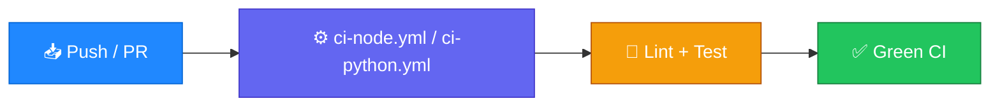

<p align="center">
  
</p>

<h1 align="center">github-actions-templates</h1>

<p align="center">
  <strong>EN</strong> Reusable CI workflows for Node.js and Python<br/>
  <strong>PT</strong> Workflows reutilizáveis de CI para Node.js e Python
</p>

<p align="center">
  <a href="https://github.com/manansbdb/github-actions-templates/blob/main/LICENSE"></a>
  
  
  <a href="#support--apoio"></a>
</p>

---

## What it does / Para que serve

| English | Português |
|---------|-----------|
| Ready-to-copy **GitHub Actions** workflows for Node and Python CI (install, lint, test). | Workflows **GitHub Actions** prontos a copiar para CI Node e Python (install, lint, test). |
| Drop YAML into `.github/workflows/` and tweak versions/scripts. | Coloca o YAML em `.github/workflows/` e ajusta versões/scripts. |



---

## Install / Instalação

### 1) Clone / Clona

```bash
git clone https://github.com/manansbdb/github-actions-templates.git
cd github-actions-templates
```

### 2) Copy workflows / Copia workflows

```bash
mkdir -p /path/to/your-project/.github/workflows
cp .github/workflows/ci-node.yml /path/to/your-project/.github/workflows/
cp .github/workflows/ci-python.yml /path/to/your-project/.github/workflows/
# edit Node/Python versions and npm/pip scripts as needed
```

### Requirements / Requisitos

- `git`
- GitHub repository with Actions enabled

---

## Quick start / Início rápido

```bash
git clone https://github.com/manansbdb/github-actions-templates.git
mkdir -p .github/workflows
cp github-actions-templates/.github/workflows/ci-node.yml .github/workflows/
```

---

## Contents / Conteúdos

| Path | Purpose / Função |
|------|------------------|
| `.github/workflows/ci-node.yml` | Node.js CI workflow |
| `.github/workflows/ci-python.yml` | Python CI workflow |
| `SUPPORT.md` | Donations / Doações |

---

## Project layout / Estrutura

```text
github-actions-templates/
├── docs/banner.svg
├── .github/workflows/ci-node.yml
├── .github/workflows/ci-python.yml
├── SUPPORT.md
└── README.md
```

---

## Support / Apoio

Bitcoin donations welcome / Doações em Bitcoin bem-vindas:

```
bc1q0qfnlnxyum9u45stzxe0a7jnhtj4j0usfkqdjw
```

See [SUPPORT.md](./SUPPORT.md).

---

## License / Licença

[MIT](./LICENSE) © 2026 manansbdb
